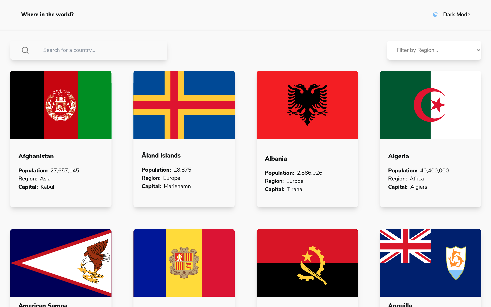

# Frontend Mentor - REST Countries API with color theme switcher solution

This is a solution to the [REST Countries API with color theme switcher challenge on Frontend Mentor](https://www.frontendmentor.io/challenges/rest-countries-api-with-color-theme-switcher-5cacc469fec04111f7b848ca). Frontend Mentor challenges help you improve your coding skills by building realistic projects.

## Table of contents

- [Frontend Mentor - REST Countries API with color theme switcher solution](#frontend-mentor---rest-countries-api-with-color-theme-switcher-solution)
  - [Table of contents](#table-of-contents)
  - [Overview](#overview)
    - [The challenge](#the-challenge)
    - [Screenshot](#screenshot)
    - [Links](#links)
  - [My process](#my-process)
    - [Built with](#built-with)
    - [What I learned](#what-i-learned)
    - [Continued development](#continued-development)
  - [Author](#author)
  - [Acknowledgments](#acknowledgments)

## Overview

### The challenge

Users should be able to:

- See all countries from the API on the homepage
- Search for a country using an `input` field
- Filter countries by region
- Click on a country to see more detailed information on a separate page
- Click through to the border countries on the detail page
- Toggle the color scheme between light and dark mode

### Screenshot

### Links

- Solution URL: [GitHub](https://github.com/jccdev45/rest-countries-api)
- Live Site URL: [Live Site](https://thirsty-wozniak-5475dc.netlify.app/)

## My process

### Built with

- Semantic HTML5 markup
- Flexbox
- CSS Grid
- Mobile-first workflow
- [React](https://reactjs.org/) - JS library
- [React Router Dom](https://reactrouter.com/web) - Routing
- [Axios](https://www.npmjs.com/package/axios) - Data fetching
- [TailwindCSS](https://tailwindcss.com/) - For styles

### What I learned

I thought my grip on Axios async/await requests was solid until I ran into some issues here on how to structure my data fetching. I needed an array from the initial fetch data to perform a follow-up fetch and had all sorts of confusion with the right way to put it all together (spoiler: I still am not even 100% certain that it's the "best" way but it works).

### Continued development

Continuing off my previous note, I'd like to freshen up on async requests and really make sure I properly understand the ins and outs.

## Author

- [Website](https://www.jccdev.tech)
- [Frontend Mentor](https://www.frontendmentor.io/profile/JordanCruzCorrea)
- [Twitter](https://www.twitter.com/jccdev)

## Acknowledgments

Like all my projects, I worked on this solo so...hat tip to me, myself and I. Also, Google, of course.
